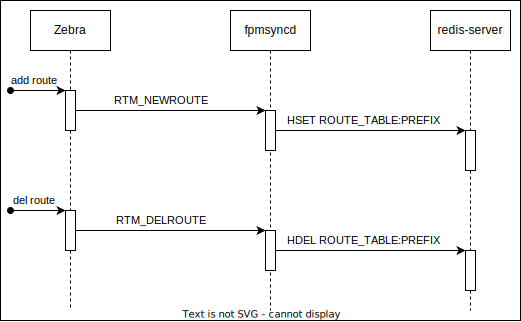

# Fpmsyncd Next Hop Table Enhancement High Level Design Document

## Table of Content 
- [Revision](#Revision)
- [Scope](#scope)
- [Overview](#Overview)
- [Requirements](#requirements)
- [Architecture Design](#architecture-design)
- [High-Level Design](#high-level-design)
  - [Value set/del to APPL_DB](#value-setdel-to-appl_db)
  - [Example of setting in APPL_DB](#example-of-setting-in-appl_db)
- [SAI API](#sai-api)
- [Restrictions/Limitations](#testing-requirementsdesign)
	- [Unit Test cases](#unit-test-cases)
	- [System Test cases](#system-test-cases)
- [Open/Action items](#openaction-items---if-any)
### Revision  

|  Rev  | Date  |     Author      | Change Description |
| :---: | :---: | :-------------: | ------------------ |
|  0.1  | TBD   | Kanji Nakano   | Initial version    | 

### Scope  

This document details the design and implementation of the `fpmsyncd extension` to NextHop Group behavior in SONiC.
Main goal of `fpmsyncd extension` is to combine NextHop Group functionality into SONiC by writing NextHop Group settings from Fpmsyncd to APPL_DB for NextHop Group operation in SONiC.

### Overview 

SONIC system has support for programming routes using the next-hop group feature through the next-hop group table in APPL_DB database. The idea is to have a more efficient system that would involve managing the next hop groups in use by the route table separately, and simply have the route table specify a reference to which next hop group to use. Since at scale many routes will use the same next hop groups, this requires much smaller occupancy per route, and so more efficient building, transmission and parsing of per-route information. 

The current version of fpmsyncd has no support to handle the next-hop group netlink messages sent by zebra process when it uses the new dplane_fpm_nl module. The implementation changes the fpmsyncd code to handle the new RTM_NEWNEXTHOP and RTM_DELNEXTHOP events and write it to the database. Also, the fpmsyncd was modified to use the next-hop group ID when programming the route into the route table.

These capabilities consist in:
- Fpmsyncd is responsible for enabling the SET/DEL setting of NEXT_HOP_GROUP_TABLE for APPL_DB in redis-DB.

### Requirements

`Fpmsyncd extension` requires:
- Fpmsyncd needs to support the NextHop Group DB value of NEXT_HOP_GROUP_TABLE.

### Architecture Design 
<!--

This section covers the changes that are required in the SONiC architecture. In general, it is expected that the current architecture is not changed.
This section should explain how the new feature/enhancement (module/sub-module) fits in the existing architecture. 

If this feature is a SONiC Application Extension mention which changes (if any) needed in the Application Extension infrastructure to support new feature.
-->

This design directly modifies Fpmsyncd to use the new APP_DB tables.

The current fpmsyncd handle just the RTM_NEWROUTE and RTM_DELROUTE writing all
route information for each route prefix into ROUTE table on redis server. When zebra process is
initialized using the old fpm module, the RTM_NEWROUTE is sent with at least destination
address, gateway, and interface id attributes. For multipath route, the RTM_NEWROUTE is sent
with a list of gateways and interfaces id.


### High-Level Design 
<!--

This section covers the high level design of the feature/enhancement. This section covers the following points in detail.
		
	- Is it a built-in SONiC feature or a SONiC Application Extension?
	- What are the modules and sub-modules that are modified for this design?
	- What are the repositories that would be changed?
	- Module/sub-module interfaces and dependencies. 
	- SWSS and Syncd changes in detail
	- DB and Schema changes (APP_DB, ASIC_DB, COUNTERS_DB, LOGLEVEL_DB, CONFIG_DB, STATE_DB)
	- Sequence diagram if required.
	- Linux dependencies and interface
	- Warm reboot requirements/dependencies
	- Fastboot requirements/dependencies
	- Scalability and performance requirements/impact
	- Memory requirements
	- Docker dependency
	- Build dependency if any
	- Management interfaces - SNMP, CLI, RestAPI, etc.,
	- Serviceability and Debug (logging, counters, trace etc) related design
	- Is this change specific to any platform? Are there dependencies for platforms to implement anything to make this feature work? If yes, explain in detail and inform community in advance.
	- SAI API requirements, CLI requirements, ConfigDB requirements. Design is covered in following sections.
-->

fpmsyncd processing flow is shown.For example. The following routes:
```
S>* 8.8.8.0/24 [1/0] via 10.0.1.5, Ethernet4, weight 1, 00:00:05
* via 10.0.1.6, Ethernet4, weight 1, 00:00:05
S>* 9.9.9.0/24 [1/0] via 10.0.1.5, Ethernet4, weight 1, 00:00:19
* via 10.0.1.6, Ethernet4, weight 1, 00:00:19
```

Will generate the following database entries:
```
admin@sonic:~$ sonic-db-cli APPL_DB hgetall "ROUTE_TABLE:8.8.8.0/24"
{'nexthop': '10.0.1.5,10.0.1.6', 'ifname': 'Ethernet4,Ethernet4', 'weight':
'1,1'}
admin@sonic:~$ sonic-db-cli APPL_DB hgetall "ROUTE_TABLE:9.9.9.0/24"
{'nexthop': '10.0.1.5,10.0.1.6', 'ifname': 'Ethernet4,Ethernet4', 'weight':
'1,1'}
```

The flow below shows how the zebra, fpmsyncd and Redis database works when using the fpm
module without next-hop group:

Figure: Flow diagram without next-hop group


To support the nexthop group the fpmsyncd was modified to handle the new events
RTM_NEWNEXTHOP and RTM_DELNEXTHOP. The fpmsyncd has now a new logical to
associate the routes to the nexthop groups. The flow for the new nexthop group feature is shown
below:

Figure: Flow diagram new nexthop group feature


#### Value set/del to APPL_DB
After enabling the dplane_fpm_nl module the zebra process starts to send to fpmsyncd the
RTM_NEWNEXTHOP when a new route is added. The RTM_NEWNEXTHOP event is sent
with 2 different attribute groups as shown in the table below:

<table>
  <tr><td>Event</td><td>Attrivutes</td><td>Description</td></tr>
  <tr><td rowspan="3">RTM_NEWNEXTHOP</td><td>NHA_ID</td><td>The nexthop group ID</td></tr>
  <tr><td>NHA_GATEWAY</td><td>The gateway address</td></tr>
  <tr><td>NHA_OIF</td><td>The interface ID</td></tr>
  <tr><td rowspan="2">RTM_NEWNEXTHOP</td><td>NHA_ID</td><td>The nexthop group ID</td></tr>
  <tr><td>NHA_GROUP</td><td>A list of nexthop groups IDs with its respective weights.</td></tr>
</table>

After sending the RTM_NEWNEXTHOP events, the zebra process sends the RTM_NEWROUTE event with the nexthop group ID as shown in the table below:

<table>
  <tr><td>Event</td><td>Attrivutes</td><td>Description</td></tr>
  <tr><td rowspan="2">RTM_NEWNROUTE</td><td>RTA_DST</td><td>The route prefix address</td></tr>
  <tr><td>RTA_NH_ID</td><td>The nexthop group ID</td></tr>
</table>

#### Example of setting in APPL_DB
For example. The following route configuration will generate the events show in the table below:
```
S>* 8.8.8.0/24 [1/0] via 10.0.1.5, Ethernet4, weight 1, 00:01:09 
  * via 10.0.2.6, Ethernet8, weight 1, 00:01:09 
S>* 9.9.9.0/24 [1/0] via 10.0.1.5, Ethernet4, weight 1, 00:00:04 
  * via 10.0.2.6, Ethernet8, weight 1, 00:00:04
```
<table>
  <tr><td>Seq</td><td>Event</td><td>Attrivutes</td><td>Value</td></tr>
  <tr><td rowspan="3">1</td><td rowspan="3">RTM_NEWNEXTHOP</td><td>NHA_ID</td><td>116</td></tr>
  <tr><td>NHA_GATEWAY</td><td>10.0.1.5</td></tr>
  <tr><td>NHA_OIF</td><td>22</td></tr>
  <tr><td rowspan="3">2</td><td rowspan="3">RTM_NEWNEXTHOP</td><td>NHA_ID</td><td>117</td></tr>
  <tr><td>NHA_GATEWAY</td><td>10.0.2.6</td></tr>
  <tr><td>NHA_OIF</td><td>23</td></tr>
  <tr><td rowspan="2">3</td><td rowspan="2">RTM_NEWNEXTHOP</td><td>NHA_ID</td><td>118</td></tr>
  <tr><td>NHA_GROUP</td><td>[{116,1},{117,1}]</td></tr>
  <tr><td rowspan="2">4</td><td rowspan="2">RTM_NEWNROUTE</td><td>RTA_DST</td><td>8.8.8.0/24</td></tr>
  <tr><td>RTA_NH_ID</td><td>118</td></tr>
  <tr><td rowspan="2">5</td><td rowspan="2">RTM_NEWNROUTE</td><td>RTA_DST</td><td>9.9.9.0/24</td></tr>
  <tr><td>RTA_NH_ID</td><td>118</td></tr>
</table>

A short description of fpmsyncd logical:
• When receiving the RTM_NEWNEXTHOP events of sequence 1, 2 and 3, the fpmsyncd will save the information into an internal list to be used when necessary.
• When the fpmsyncd receive the RTM_NEWROUTE sequence 4, the process will write the next-hop group with ID 118 into the NEXTHOP_GROUP_TABLE table using the information of gateway and interface from the next-hop group events with IDs 116 and 117. After, the fpmsyncd will create a new route entry into ROUTE_TABLE table with a nexthop_group field with value “ID118”.
• When fpmsyncd receives the last RTM_NEWROUTE sequence 5, the process just create a new route entry into the ROUTE_TABLE table with a nexthop_group field with value “ID118”. The next-hop group entry was created when the fpmsyncd received the event sequence 4.

The ASIC_DB entry is not changed by the enhancement. Therefore, even after this enhancement, table entries will be created for ROUTE_ENTRY, NEXT_HOP_GROUP, NEXT_HOP_GROUP_MEMBER, and NEXT_HOP respectively, as shown in the example below

Figure: Example of ASIC_DB entry


### SAI API 
No changes are being made in SAI. The end result of what gets programmed over the SAI will be the same as currently gets programmed - the difference is the programming sequence to get there.

<!--
### Configuration and management 

The output of 'show ip route' and 'show ipv6 route' will remain unchanged - the CLI code will resolve the next hop group ID referenced in the ROUTE_TABLE to display the next hops for the routes.


#### Manifest (if the feature is an Application Extension)

Paste a preliminary manifest in a JSON format.

#### CLI/YANG model Enhancements 


This sub-section covers the addition/deletion/modification of CLI changes and YANG model changes needed for the feature in detail. If there is no change in CLI for HLD feature, it should be explicitly mentioned in this section. Note that the CLI changes should ensure downward compatibility with the previous/existing CLI. i.e. Users should be able to save and restore the CLI from previous release even after the new CLI is implemented. 
This should also explain the CLICK and/or KLISH related configuration/show in detail.
https://github.com/sonic-net/sonic-utilities/blob/master/doc/Command-Reference.md needs be updated with the corresponding CLI change.

#### Config DB Enhancements  
-

This sub-section covers the addition/deletion/modification of config DB changes needed for the feature. If there is no change in configuration for HLD feature, it should be explicitly mentioned in this section. This section should also ensure the downward compatibility for the change. 

### Warmboot and Fastboot Design Impact  


Mention whether this feature/enhancement has got any requirements/dependencies/impact w.r.t. warmboot and fastboot. Ensure that existing warmboot/fastboot feature is not affected due to this design and explain the same.

### Restrictions/Limitations  
-->

### Testing Requirements/Design  
TBD

<!--
Explain what kind of unit testing, system testing, regression testing, warmboot/fastboot testing, etc.,
Ensure that the existing warmboot/fastboot requirements are met. For example, if the current warmboot feature expects maximum of 1 second or zero second data disruption, the same should be met even after the new feature/enhancement is implemented. Explain the same here.
Example sub-sections for unit test cases and system test cases are given below. 
-->
#### Unit Test cases  
TBD

#### System Test cases
TBD

### Open/Action items - if any 
<!--

NOTE: All the sections and sub-sections given above are mandatory in the design document. Users can add additional sections/sub-sections if required.
-->
