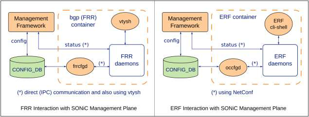
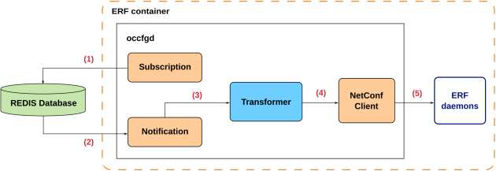
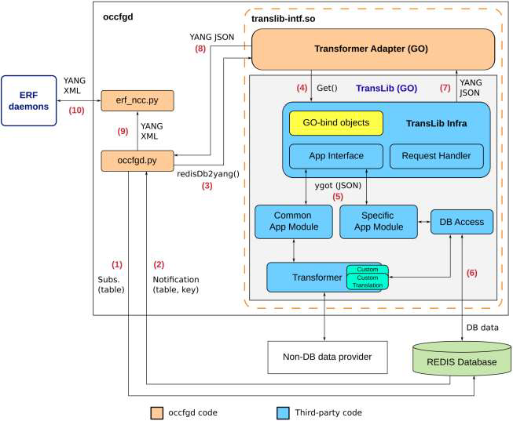

# OpenConfig based config synchronize function
<!-- omit in toc -->
## High Level Design Document

## Table of Content 
- [Revision](#revision)
- [Scope](#scope)
- [Definitions/Abbreviations](#definitionsabbreviations)
- [Overview](#overview)
- [Requirements](#requirements)
- [Architecture Design](#architecture-design)
- [High-Level Design](#high-level-design)
	- [Subscription](#subscription)
	- [Notification](#nortification)
	- [Data model conversion](#data-model-conversion)
	- [NETCONF Client](#netconf-client)
- [SAI API](#sai-api)
- [Configuration and management](#configuration-and-management)
	- [CLI/YANG model Enhancements](#cliyang-model-enhancements)
	- [Config DB Enhancements](#config-db-enhancements)
- [Warmboot and Fastboot Design Impact](#warmboot-and-fastboot-design-impact)
- [Restrictions/Limitations](#restrictionslimitations)
	- [Unit Test cases](#unit-test-cases)
	- [System Test cases](#system-test-cases)
- [Open/Action items](#openaction-items---if-any)
### Revision  

|  Rev  | Date  |     Author      | Change Description |
| :---: | :---: | :-------------: | ------------------ |
|  0.1  | TBD   | Hitoshi Irino   | Initial version    |

### Scope  

This document presents design and implementation details for a module called `occfgd` which synchronize configuration between Redis CONFIG_DB and OpenConfig based container providing routing functionality.
Main goal of occfgd is to make possible configuration and status of External Routing Function modules, which is other than FRRouting, working on SONiC from SONiC Management Plane, integrating External Routing Function  with SONiC infra.

### Definitions/Abbreviations 

This section covers the abbreviation if any, used in this high-level design document and its definitions.

| Definitions/Abbreviation | Description                                                                                 |
| ------------------------ | --------------------------------------------------------------------------------------------|
| ERF                      | External Routing Function which is routing fucntion container on SONiC other than FRRouting |
| FRR                      | Free Range Routing                                                                          |
| REST                     | Representational State Transfer                                                             |
| MP                       | Management Plane                                                                            |
| NBI                      | North Bound Interface                                                                       |
| POC                      | Proof of Concept                                                                            |
| SONiC                    | Software for Open Networking in the Cloud                                                   |
| SWSS                     | SWitch State Service                                                                        |
| OS                       | Operating System                                                                            |
| VM                       | Virtual Machine                                                                             |

### Overview 

`occfgd` is responsible for making ERF configuration possible from SONiC by integrating ERF
MP with SONiC infrastructure. These capabilities consist in:
- Allowing ERF modules to communicate with SONiC infra via redis-DB
- Translation from SONiC datamodel to OpenConfig YANG, performed using TransLib
SONiC framework
- Use of SONiC management framework

### Requirements

<!-- This section list out all the requirements for the HLD coverage and exemptions (not supported) if any for this design. -->

`occfgd` requires:

- ERF needs to support openconfig data model and NETCONF protocol
- ERF expects CONFIG_DB update from SONiC management framework.

### Architecture Design 

<!-- 
This section covers the changes that are required in the SONiC architecture. In general, it is expected that the current architecture is not changed.
This section should explain how the new feature/enhancement (module/sub-module) fits in the existing architecture. 

If this feature is a SONiC Application Extension mention which changes (if any) needed in the Application Extension infrastructure to support new feature.
-->

SONiC infrastructure relies on redis-DB engine for communication among its components.
Because of this, ERF integration with SONiC infrastructure demands ERF to be able to
communicate via redis-DB.

This HLD propose `occfgd` to solve this. occfgd is based on SONiC FRRcfgd,
which plays a similar role in SONiC FRR bgp container, converting redis-DB data to vtysh
commands.

<!-- comment out
The following figure shows a high-level placement of the module, interposing between ERF and
SONiC infra similarly to FRRcfgd in bgp (FRR) container:
-->

<!-- additonal description -->
The difference is that frrcfgd converts the contents of the Config DB to FRRouting-specific settings for a BGP container running FRRouting routing, and sets them using vtysh commands, whereas occfgd converts the contents of the standard data model OpenConfig-compliant routing container to OpenConfig-compliant settings, and sets them using NETCONF, the standard protocol for configuration.
<!-- additional description -->



### High-Level Design 
<!--
This section covers the high level design of the feature/enhancement. This section covers the following points in detail.
		
	- Is it a built-in SONiC feature or a SONiC Application Extension?
	- What are the modules and sub-modules that are modified for this design?
	- What are the repositories that would be changed?
	- Module/sub-module interfaces and dependencies. 
	- SWSS and Syncd changes in detail
	- DB and Schema changes (APP_DB, ASIC_DB, COUNTERS_DB, LOGLEVEL_DB, CONFIG_DB, STATE_DB)
	- Sequence diagram if required.
	- Linux dependencies and interface
	- Warm reboot requirements/dependencies
	- Fastboot requirements/dependencies
	- Scalability and performance requirements/impact
	- Memory requirements
	- Docker dependency
	- Build dependency if any
	- Management interfaces - SNMP, CLI, RestAPI, etc.,
	- Serviceability and Debug (logging, counters, trace etc) related design
	- Is this change specific to any platform? Are there dependencies for platforms to implement anything to make this feature work? If yes, explain in detail and inform community in advance.
	- SAI API requirements, CLI requirements, ConfigDB requirements. Design is covered in following sections.
-->

occfgd's processing flow is shown in the figure below.



1. occfgd subscribes to all relevant configuration database tables
2. Redis notifies occfgd configuration events related to the subscribed tables
3. Notification is processed by a dedicated handler that will format and forward it to the
Datamodel Conversion Module so that SONiC redis-DB data is converted to OpenConfig
YANG
4. Resulting OpenConfig YANG data is further processed, making it compatible for
NETCONF edit operation
5. The configuration is pushed to ERF modules via NETCONF

“Transformer” is the a general component responsible for redis-DB/YANG data conversion.
SONiC infra has been integrated with occfgd initial development in two distinct ways in order to
provide this functionality, described in the following sections. In both cases, TransLib code is
used. TransLib is a SONiC Management Framework component which code is found in sonicbuildimage/
src/sonic-mgmt-common. As this code is written in Go language, we compile it as
a shared library (.so) so it can be accessed by occfgd without imposing it to be written in Go
language as well. occfgd has been written in Python programming language. This is because
most of the related SONiC framework code is available in Python language, which includes
redis-DB Subscription and Notification. Also, a commonly used NETCONF client called ncclient is
available in Python.

#### Subscription
Each corresponding handler function must be implemented taking into account the specific
SONiC redis-DB schema. In the case of FRRCfgd these handlers convert the given table entry to
vtysh commands that configure directly with the target FRR daemons. In case of occfgd, the
handlers will communicate with ERF via NETCONF. This is done in order to facilitate NETCONF
support. This approach also leverages SONiC infra that eases translation between SONiC redis-
DB and OpenConfig YANG datamodels.

occfgd main module is implemented as a class called occfgd, which aggregates redis-DB table
subscription deriving from sonic-swss-common ConfigDBConnector class:

```
class occfgd:
def __init__(self, occfgd_cfg):
...
# Connect with redis-DB and NETCONF servers
self._init_connect_db_client()
...
def _init_connect_db_client(self):
connected = False
while connected is False:
try:
self.config_db = ExtConfigDBConnector()
self.config_db.connect()
connected = True
```

In order to use ConfigDBConnector, SONiC libswsscommon python package and its
dependencies must be installed in the same container as occfgd. For the exact description of
build and runtime dependencies of occfgd, refer to the “Dependencies” section.
In order to be able to access redis-DB used by SONiC infra, applications must be able to access
redis-DB database directories. This is accomplished by exposing or mapping Redis server
directory to the host container with the “volume” docker parameter: `-v
/var/run/redis/:/var/run/redis/` when instantiating the docker image (docker run
command). As occfgd is set to run in SONiC mgmt-framework container, this mapping is
already done in its startup script (/usr/bin/mgmt-framework.sh).

#### Nortification

When a database entry (such as from CONFIG_DB) is created, deleted or modified, a notification
will be emitted by redis-DB. The configuration data flow effectively starts with this redis-DB
notification in occfgd point of view.
However, redis-DB notifications only include table, key(s) for the corresponding entry, without
its corresponding data. This is because of Redis design approach that avoids overhead caused by
potentially several MBs of data being supported for a single entry. The corresponding data must
be fetched by the notified module based on the received table name and key. Code from
FRRCfgd fetching database data based on the received notification entry (table, key) is shown in
the code snippet below (more specifically, in the line `“data =
self.raw_to_typed(client.hgetall(key), table)"):`

```
def sub_msg_handler(self, msg_item):
	if msg_item['type'] == 'pmessage':
		key = msg_item['channel'].split(':', 1)[1]
		try:
			(table, row) = key.split(self.TABLE_NAME_SEPARATOR, 1)
			if table in self.handlers:
				client = self.get_redis_client(self.db_name)
				data = self.raw_to_typed(client.hgetall(key), table)
				super(ExtConfigDBConnector, self)._ConfigDBConnector__fire(table, row, data)
		except ValueError:
			pass #Ignore non table-formated redis entries
		except Exception as e:
			syslog.syslog(syslog.LOG_ERR, '[bgp cfgd] Failed handling config DB update with exception:' + str(e))logging.exception(e)
```

The fetched data is then passed along with table and key to the registered handler.
This handler must parse incoming redis-DB notification info (table, key) and build a request for
TransLib
to convert it to OpenConfig YANG. As an example, the CLI (KLISH) command that assigns an
IP to an interface:

```
admin@sonic:~$ sonic-cli
sonic# configure terminal
sonic(config)# interface Ethernet 0
sonic(conf-if-Ethernet0)# ip address 192.0.2.1/24
Success
```
Writes the following CONFIG_DB entry:
```
Received redis-DB notification: (table, key) = (INTERFACE,Ethernet0|192.0.2.1/24)
```
`INTERFACE_TABLE` handler will be triggered by a redis-DB notification with this info.
Interface handler must parse this entry and build a request for TransLib. Using TransLib Get ()
interface as explained in the next section, the resulting get request is the xpath/URI of the data to be converted:

`/openconfig-interfaces:interfaces/interface[name=Ethernet0]`

And TransLib returns:

```
{
	"openconfig-interfaces:interface": [
	{
		"config": {
			"description": "",
			"mtu": 9100,
			"name": "Ethernet0"
		},
		"name": "Ethernet0",
		"openconfig-if-ethernet:ethernet": {
			"config": {
				"port-speed": "openconfig-if-ethernet:SPEED_40GB"
			},
			"state": {
				"port-speed": "openconfig-if-ethernet:SPEED_40GB"
			}
		},
		"state": {
			"admin-status": "UP",
			"counters": {
				"in-broadcast-pkts": "0",
				"in-discards": "0",
				"in-errors": "0",
				"in-multicast-pkts": "0",
				"in-octets": "0",
				"in-pkts": "0",
				"in-unicast-pkts": "0",
				"out-broadcast-pkts": "0",
				"out-discards": "0",
				"out-errors": "0",
				"out-multicast-pkts": "0",
				"out-octets": "0",
				"out-pkts": "0",
				"out-unicast-pkts": "0"
			},
			"description": "",
			"ifindex": 0,
			"mtu": 9100,
			"name": "Ethernet0",
			"oper-status": "UP"
		},
		"subinterfaces": {
			"subinterface": [
			{
				"index": 0,
				"openconfig-if-ip:ipv4": {
					"addresses": {
						"address": [
						{
							"config": {
								"ip": "192.0.2.1",
								"prefix-length": 24
							},
							"ip": "192.0.2.1",
							"state": {
								"ip": "192.0.2.1",
								"prefix-length": 24
							}
						},
						{
							"config": {
								"ip": "10.0.0.0",
								"prefix-length": 31
							},
							"ip": "10.0.0.0",
							"state": {
								"ip": "10.0.0.0",
								"prefix-length": 31
							}
						}
						]
					}
				}
			}
			]
		}
	}
	]
}
```

Get () request specifying data to be translated should be as specific as possible. For instance,
the following xpath:

`/interfaces/interface[name=Ethernet0]/subinterfaces/subinterface[index=0]/ \
ipv4/addresses/address[address=192.0.2.1]/config`

Would better match the configuration specified in the notification. However, for the current
SONiC interface translation code (`sonic-buildimage/src/sonic-mgmtcommon/
translib/intf_app.go`), Get () is not supported in xpath subinterfaces level.

In order to solve this, some post processing takes place in occfgd. An example of such post processing the YANG data is the removal of state containers for the sample data shown above and ensuring the resulting YANG starts at the root container with the corresponding namespace.

As we can see, it requires some code to build the right Get () request and post-process the
resulting data retrieved by TransLib for configurations already implemented in SONiC. During
occfgd development, existing interface translations have been incremented. For instance, to
allow support for loopback interfaces.
For newer configurations such as for BGP and OSPF, using the latest management framework
(with KLISH support), the translations must be implemented from scratch. Because of this, code
building requests and post-processing in occfgd tend to be simpler since we can make sure the
specific xpaths for the desired configuration are implemented.

#### Data model conversion
SONiC infrastructure provides functionality to ease conversion of redis-DB schema (SONiC datamodel)
and OpenConfig YANG in TransLib module (`sonic-buildimage/src/sonic-mgmtcommon/translib`).

This approach consists in using SONiC TransLib API, the same used by the REST/GNMI
servers. One noticeable distinction here is that while Transformer module is responsible for
redis-DB/YANG data translation, TransLib interacts with the redis-DB directly. TransLib can
use the Transformer package for translation (via the Common App Module), but also
encompasses manual translations (called “Specific App Module”).

This approach is shown in following diagram.



1. occfgd.py subscribes to all relevant database entries (table, key)
2. When a new relevant configuration is pushed to CONFIG_DB, occfgd.py is notified.
Note that this notification includes identification (table, key) of the entry which was
created, removed or changed, but it does not include the corresponding entry data
3. Based on the received entry identification (table, key), occfgd.py maps it to an xpath
(such as /openconfig-acl:acl/acl-sets/acl-set[<name>][<type>]/config) and
invokes translib-intf.so API redisDb2yang()
4. Transformer Adapter simply calls TransLib Get() method passing the given xpath as the
parameter for redisDb2yang()
5. A TransLib module called App Interface will inspect the xpath and determine the base
module responsible the translation. It performs a lookup on a map of Specific App
Modules hashed by base paths. If one is found, that will be used for the translation. This
Specific App Modules contain manual translation code. If no Specific App Module is
found, the Common App Module is used. This uses the Transformer to perform the
translation
6. All relevant data is fetched from redis-DB by the TransLib infra based on the provided
xpath
7. The translated data is now in YANG JSON format and is returned to the Transformer
Adapter
8. The YANG JSON is returned to occfgd.py
9. occfgd.py possibly do more processing depending on the data received, converts it from
YANG JSON to YANG XML using a pyang suite tool called json2xml and forwards it
to erf_ncc.py
10. erf_ncc.py finally sends the YANG XML configuration to ERF NETCONF server, using
edit_config() method

##### jtox code generation
<!-- IPI documents 5.5 Code (報告書ベースに順番を入替) -->
jtox are driver files generated from YANG datamodels to be used by the pyang tool json2xml
for YANG JSON/XML conversion.
As an example, openconfig-interfaces.jtox was created with:
```
sonic-mgmt-common$ pyang -f jtox -o openconfig-interfaces.jtox -p models/ \
models/yang/openconfig-interfaces.yang \
models/yang/openconfig-if-ethernet.yang \
models/yang/common/openconfig-if-ip-ext.yang
```
The following example shows how the JTOX driver file is used to convert YANG JSON to
XML, similarly to how it’s done by occfgd.py:
```
$ cat interfaces-config-data.json
{
	"openconfig-interfaces:interfaces": {
		"interface": [
			{
				"config": {
					"description": "Ethernet0 sample description",
					"mtu": 9100,
					"name": "Ethernet0"
				},
				"name": "Ethernet0",
				"openconfig-if-ethernet:ethernet": {
					"config": {
						"port-speed": "openconfig-if-ethernet:SPEED_40GB"
					}
				},
				"subinterfaces": {
					"subinterface": [
					{
						"index": 0,
						"openconfig-if-ip:ipv4": {
							"addresses": {
							"address": [
								{
									"config": {
										"ip": "10.0.0.0",
										"prefix-length": 31
									},
									"ip": "10.0.0.0"
								},
								{
									"config": {
										"ip": "9.9.9.9",
										"prefix-length": 24
									},
									"ip": "9.9.9.9"
								}
							]
							}
						}
					}
					]
				}
			}
		]
	}
}
```

```
$ json2xml -t config openconfig-interfaces.jtox interfaces-config-data.json |
xmllint --format -
<?xml version="1.0" encoding="utf-8"?>
<nc:config xmlns:nc="urn:ietf:params:xml:ns:NETCONF:base:1.0" xmlns:oceth="
http://openconfig.net/yang/interfaces/ethernet" xmlns:ocif="
http://openconfig.net/yang/interfaces" xmlns:ocip="
http://openconfig.net/yang/interfaces/ip" xmlns:ocext="
http://openconfig.net/yang/openconfig-ext" xmlns:octypes="
http://openconfig.net/yang/openconfig-types"
xmlns:ianaift="urn:ietf:params:xml:ns:yang:iana-if-type"
xmlns:yang="urn:ietf:params:xml:ns:yang:ietf-yang-types" xmlns:oc-ipext="
http://openconfig.net/yang/interfaces/ip-ext" xmlns:ocvlan="
http://openconfig.net/yang/vlan" xmlns:oc-vlantypes="
http://openconfig.net/yang/vlan-types" xmlns:ocift="
http://openconfig.net/yang/openconfig-if-types" xmlns:ocyang="
http://openconfig.net/yang/types/yang" xmlns:ocinet="
http://openconfig.net/yang/types/inet"
xmlns:if="urn:ietf:params:xml:ns:yang:ietf-interfaces" xmlns:oclag="
http://openconfig.net/yang/interfaces/aggregate">
	<oc-if:interfaces>
		<oc-if:interface>
			<oc-if:name>Ethernet0</oc-if:name>
			<oc-if:config>
				<oc-if:description>Ethernet0 sample description</oc-if:description>
				<oc-if:mtu>9100</oc-if:mtu>
				<oc-if:name>Ethernet0</oc-if:name>
			</oc-if:config>
			<oc-eth:ethernet>
				<oc-eth:config>
					<oc-eth:port-speed>oc-eth:SPEED_40GB</oc-eth:port-speed>
				</oc-eth:config>
			</oc-eth:ethernet>
			<oc-if:subinterfaces>
				<oc-if:subinterface>
				<oc-if:index>0</oc-if:index>
					<oc-ip:ipv4>
						<oc-ip:addresses>
							<oc-ip:address>
								<oc-ip:ip>10.0.0.0</oc-ip:ip>
								<oc-ip:config>
									<oc-ip:ip>10.0.0.0</oc-ip:ip>
									<oc-ip:prefix-length>31</oc-ip:prefix-length>
								</oc-ip:config>
							</oc-ip:address>
							<oc-ip:address>
								<oc-ip:ip>9.9.9.9</oc-ip:ip>
								<oc-ip:config>
									<oc-ip:ip>9.9.9.9</oc-ip:ip>
									<oc-ip:prefix-length>24</oc-ip:prefix-length>
								</oc-ip:config>
							</oc-ip:address>
						</oc-ip:addresses>
					</oc-ip:ipv4>
				</oc-if:subinterface>
			</oc-if:subinterfaces>
		</oc-if:interface>
	</oc-if:interfaces>
</nc:config>
```

#### NETCONF Client

occfgd will receive OpenConfig YANG based data from CONFIG_DB and send it to ERF
container via NETCONF.
ncclient (https://github.com/ncclient/ncclient ) has been chosen to serve as the NETCONF client for
this mainly for the following reasons:
- It has been adopted in other systems so it has proved reliability and familiarity
among developers
- Python support, which is the language used by most of the SONiC framework so interoperability is enhanced

<!--
A class named OMWNcc takes care to implement ncclient interface with occfgd.
During startup, occfgd instantiates an object of OMWNcc class which has the initialization
function:
class OMWNcc:
def __init__(self, ncc_cfg, enable_debug):
self._enable_debug = enable_debug
self._print_debug(
"Starting OMWNcc with serv_addr: {}, port: {}".format(
ncc_cfg["serv_addr"], ncc_cfg["port"]
)
)
self._ncc = manager.connect(
host=ncc_cfg["serv_addr"],
port=ncc_cfg["port"],
username=ncc_cfg["username"],
password=ncc_cfg["password"],
timeout=int(ncc_cfg["timeout"]),
hostkey_verify=False,
allow_agent=False,
look_for_keys=False,
)
self._ncc.create_subscription()
...
Note create_subscription () is called in order to prevent connection timeout to be triggered
when no
interaction from the client takes place for a long time.
This initialization function connects to the ERF NETCONF server and Netopeer2.
The server IP address is passed by occfgd as defined in a configuration file called occfgd.conf
as shown below with default values:
[GENERAL]
enable_debug=false
without-erf=false
[NCC_CONFIG]
serv_addr=localhost
port=30830
username=admin
password=YourPaSsWoRd
timeout=300
[NETOPEER2_NCC_CONFIG]
serv_addr=localhost
port=830
username=admin
password=YourPaSsWoRd
timeout=300
without-erf controls whether occfgd establishes communication with ERF. By setting it to
true, occfgd can operate only feeding configuration data to Netopeer2. This option allows occfgd
to run without ERF container running in the device.

Note that the container running occfgd must expose the referred ports in the configuration above
to allow connection of occfgd from inside the container. This can be done via the port (-p)
parameter when creating the container instance. However, since occfgd is set to run in SONiC
mgmt-framework container, this is not necessary because all ports are exposed with --
network=host parameter (SONiC script /usr/bin/mgmt-framework.sh). The same is true for
ERF container, which should expose ERF NETCONF port.
-->

Once a configuration notification is received by occfgd, its conversion to OpenConfig YANG is
requested to TransLib as shown in a previous section. The received data will be processed by
occfgd when building the final NETCONF payload.
This involves ensuring the data tree is complete from the root path and the related namespace is
provided. Resulting OpenConfig YANG payload must also be converted to XML, the datamodel
encoding supported by ncclient.

The conversion is performed using specialized YANG json2xml tool from pyang suite.
Once converted, the XML payload is pushed using ncclient edit_config () API, proceeded by
commit ().

The amount of post-processing required over the YANG data retrieved from TransLib will
depend on how closely the xpath provided in TransLib Get () matches the received
configuration in redis-DB notification.

Need for replace operation is the case specially when part of a configuration is deleted and we only have the updated configuration. However, supporting replace operation is quite involving to ERF as it also has to translate the incoming OpenConfig data to its internal datamodel. It must be verified if the resulting payload, potentially including this operation, is supported for all use cases. In the example above, the operation replace will probably be added to a lower level (more specific) container.

#### Dependencies

The following table lists the expected tools/packages needed by occfgd during runtime. Version
is the installed version for initial POC test development and may change in the future. All these
packages/tools are to be installed in the target container in which occfgd is to be run. Some of
these packages are also installed via apt-get in SONiC as can be seen in sonicbuildimage/
dockers/docker-sonic-mgmt/Dockerfile.j2

|Name              |Version|Description                                                                                                                     |
|------------------|-------|--------------------------------------------------------------------------------------------------------------------------------|
|python3           |3.9.2  |Python interpreter installed via `apt-get install python3-dev`                                                                  |
|python3-pip       |20.3.4 |Python package manager, used to install `pyang` suite and `ncclient`. Installed via `apt-get install python3-pip`               |
|pyang             |2.5.3  |`occfgd` needs this package so it can use included `json2xml` tool to convert YANG JSON to XML. Installed via pip3 install pyang|
|ncclient          |0.6.13 |Needed for occfgd to interface with the ERF module via NETCONF. Installed via pip3 install ncclient                             |
|sonic-mgmt-common |1.0.0  |Runtime files for `sonic-mgmt-common` (see `sonic-buildimage/src/sonic-mgmtcommon/debian`)                                      |
|python3-swsscommon|1.0.0  |Python libraries for redis-DB interface (see `sonic-buildimage/src/sonic-swsscommon/debian`)                                    |

### SAI API 

<!-- 
This section covers the changes made or new API added in SAI API for implementing this feature. If there is no change in SAI API for HLD feature, it should be explicitly mentioned in this section.
This section should list the SAI APIs/objects used by the design so that silicon vendors can implement the required support in their SAI. Note that the SAI requirements should be discussed with SAI community during the design phase and ensure the required SAI support is implemented along with the feature/enhancement.
-->

There is no change in SAI API for this feature.

### Configuration and management 
<!--
This section should have sub-sections for all types of configuration and management related design. Example sub-sections for "CLI" and "Config DB" are given below. Sub-sections related to data models (YANG, REST, gNMI, etc.,) should be added as required.
-->
#### Manifest (if the feature is an Application Extension)
<!--
Paste a preliminary manifest in a JSON format.
-->
#### CLI/YANG model Enhancements 
<!--
This sub-section covers the addition/deletion/modification of CLI changes and YANG model changes needed for the feature in detail. If there is no change in CLI for HLD feature, it should be explicitly mentioned in this section. Note that the CLI changes should ensure downward compatibility with the previous/existing CLI. i.e. Users should be able to save and restore the CLI from previous release even after the new CLI is implemented. 
This should also explain the CLICK and/or KLISH related configuration/show in detail.
https://github.com/sonic-net/sonic-utilities/blob/master/doc/Command-Reference.md needs be updated with the corresponding CLI change.
-->


#### Config DB Enhancements  
<!--
This sub-section covers the addition/deletion/modification of config DB changes needed for the feature. If there is no change in configuration for HLD feature, it should be explicitly mentioned in this section. This section should also ensure the downward compatibility for the change. 
-->
<!-- 報告書ベース。ソースコードから生成したpyang tree構造 -->
occfgd expects following extended sonic-yang and redis-DB schemes to configure ERF's vrf and OSPF configuration.

```
module: sonic-ospf
  +--rw sonic-ospf
     +--rw OSPF_GLOBAL
     |  +--rw OSPF_GLOBAL_LIST* [vrf_name name]
     |     +--rw vrf_name     -> /vrf:sonic-vrf/VRF/VRF_LIST/name
     |     +--rw name         string
     |     +--rw router_id?   inet:ip-address
     +--rw OSPF_AREA
     |  +--rw OSPF_AREA_LIST* [vrf_name name area_id]
     |     +--rw vrf_name    -> ../../../OSPF_GLOBAL/OSPF_GLOBAL_LIST[name=current()/../name]/vrf_name
     |     +--rw name        -> ../../../OSPF_GLOBAL/OSPF_GLOBAL_LIST[vrf_name=current()/../vrf_name]/name
     |     +--rw area_id     inet:ip-address
     +--rw OSPF_AREA_INTERFACE
        +--rw OSPF_AREA_INTERFACE_LIST* [vrf_name name area_id if_name]
           +--rw vrf_name    -> ../../../OSPF_GLOBAL/OSPF_GLOBAL_LIST[name=current()/../name]/vrf_name
           +--rw name        -> ../../../OSPF_GLOBAL/OSPF_GLOBAL_LIST[vrf_name=current()/../vrf_name]/name
           +--rw area_id   -> ../../../OSPF_AREA/OSPF_AREA_LIST[vrf_name=current()/../vrf_name][name=current()/../name]/area_id
           +--rw if_name     union
```

```
module: sonic-vrf
  +--rw sonic-vrf
     +--rw VRF
        +--rw VRF_LIST* [name]
           +--rw name    union
```

### Warmboot and Fastboot Design Impact  
<!--
Mention whether this feature/enhancement has got any requirements/dependencies/impact w.r.t. warmboot and fastboot. Ensure that existing warmboot/fastboot feature is not affected due to this design and explain the same.
-->

occfgd does not relate to Warmboot and Fastboot Design.

### Restrictions/Limitations  

### Testing Requirements/Design  
<!--
Explain what kind of unit testing, system testing, regression testing, warmboot/fastboot testing, etc.,
Ensure that the existing warmboot/fastboot requirements are met. For example, if the current warmboot feature expects maximum of 1 second or zero second data disruption, the same should be met even after the new feature/enhancement is implemented. Explain the same here.
Example sub-sections for unit test cases and system test cases are given below. 
-->
#### Unit Test cases  

TBD

#### System Test cases

TBD

### Open/Action items - if any 
<!--	
NOTE: All the sections and sub-sections given above are mandatory in the design document. Users can add additional sections/sub-sections if required.
-->
